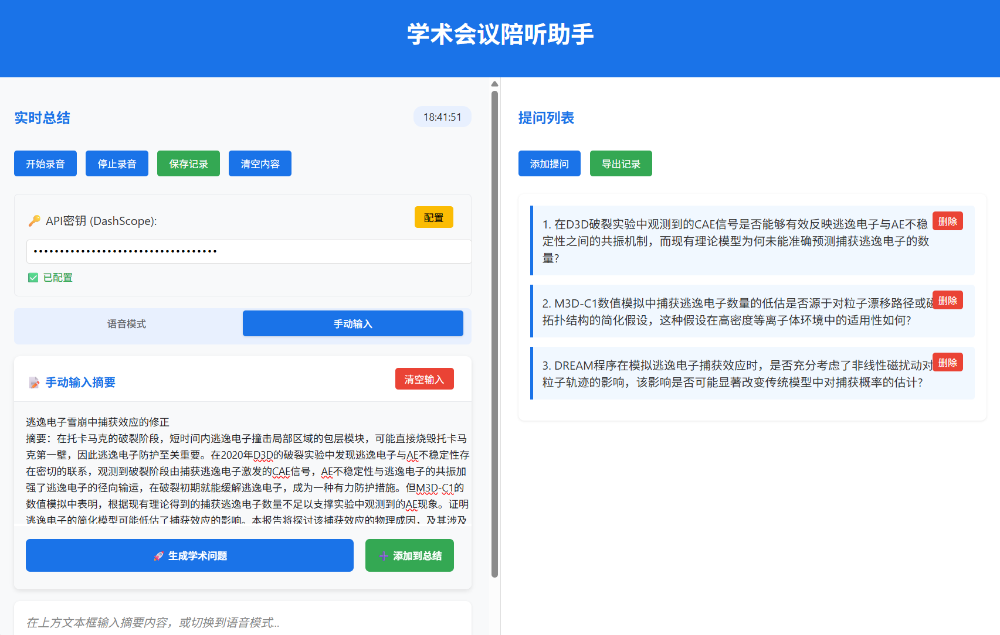

# 🎓 学术会议陪听助手 (Academic Conference Companion)

[](https://python.org)
[](https://flask.palletsprojects.com)
[](https://flutter.dev)
[](LICENSE)


> 🎯 **边听边想，智能提问** - 专为学术会议场景设计的AI助手，实现实时语音识别、智能总结与学术问题生成


## ✨ 核心特性

### 🎤 实时语音处理
- **实时语音识别**：基于Web Speech API与Whisper模型，支持中英文识别
- **流式分片处理**：5-8秒智能分片，滑动窗口保持上下文连贯性
- **噪音抑制**：WebRTC预处理，确保会议环境下的高识别准确率

### 🧠 AI驱动的内容理解
- **结构化总结**：自动提取研究背景、核心方法、实验结果、当前要点
- **学术问题生成**：针对技术细节、研究局限性、实验设计、未来方向生成专业提问
- **智能Prompt工程**：基于DashScope API的qwen-max模型，确保学术专业性

### 📱 多平台支持
- **Web端**：开箱即用，支持现代浏览器实时语音访问
- **Flutter跨平台**：Android、iOS、桌面端全支持
- **离线优先**：核心功能支持无网络环境运行

### 💾 数据管理
- **本地存储**：SQLite缓存历史记录，支持离线查看
- **多格式导出**：支持文本、Markdown、PDF格式导出
- **问题管理**：支持问题标记、删除、去重等操作

## 🚀 快速开始

### 🎯 版本选择

#### Web版 (推荐新用户)
- **基础版**：`web/simple_sci_listen.html` - 仅支持麦克风输入
- **增强版**：`web/enhanced_sci_listen.html` - 支持音频源选择（麦克风/系统音频/混合）
- **优点**：开箱即用，无需安装
- **限制**：系统音频需要浏览器权限

#### 桌面版 (推荐专业用户)
- **位置**：`desktop/` 目录
- **优点**：原生系统音频捕获，无需浏览器权限
- **安装**：需要Node.js环境

### 环境要求
- Python 3.6+
- Node.js 16+ (可选，用于前端开发)
- Flutter SDK 3.0+ (可选，用于移动端开发)

### 安装步骤

1. **克隆项目**
   ```bash
   git clone https://github.com/yourusername/sci-listen.git
   cd sci-listen
   ```

2. **安装Python依赖**
   ```bash
   pip install flask flask-cors requests
   ```

3. **配置API密钥**
   ```bash
   # 方式一：环境变量
   export DASHSCOPE_API_KEY=your_dashscope_api_key_here
   
   # 方式二：在应用内配置
   # 启动后点击配置API KEY按钮
   ```

4. **启动服务**
   ```bash
   # 启动后端API服务器
   cd api
   python working_api.py &

   # 启动前端静态服务器 (可选，也可直接打开HTML文件)
   cd ../web
   python -m http.server 8082 &
   ```

5. **访问应用**
   - 基础版：打开浏览器访问 `web/simple_sci_listen.html`
   - 增强版：打开浏览器访问 `web/enhanced_sci_listen.html` (支持音频源选择)
   - 或通过静态服务器访问：`http://localhost:8082/`
   - 或直接访问在线演示：[Demo Link]

## 🏗️ 技术架构

### 核心技术栈

| 模块 | 技术选型 | 说明 |
|------|---------|------|
| **语音采集** | Web Speech API / Whisper | 支持100+语言，学术术语识别准确率高 |
| **流式处理** | 自定义Chunk切割 | 5-8秒分片，滑动窗口保持上下文 |
| **AI推理** | DashScope (qwen-max) | 学术Prompt工程，专业问题生成 |
| **前端界面** | HTML/CSS/JS + Flutter | 分栏布局，实时更新 |
| **数据存储** | SQLite + localStorage | 离线优先，历史记录管理 |
| **跨平台** | Flutter | Android/iOS/Desktop全平台支持 |

### 系统架构图

```
┌─────────────────┐    ┌──────────────────┐    ┌─────────────────┐
│   语音输入      │    │   流式处理引擎    │    │   AI推理模块    │
│                │    │                  │    │                │
│ • 麦克风采集   │───▶│ • 分片切割      │───▶│ • 学术总结     │
│ • WebRTC降噪   │    │ • 滑动窗口      │    │ • 问题生成     │
│ • 实时传输     │    │ • 上下文管理    │    │ • Prompt工程   │
└─────────────────┘    └──────────────────┘    └─────────────────┘
                                │                        │
                                ▼                        ▼
┌─────────────────┐    ┌──────────────────┐    ┌─────────────────┐
│   用户界面      │    │   数据管理层      │    │   导出模块      │
│                │    │                  │    │                │
│ • 实时总结显示 │◀───│ • 本地缓存      │◀───│ • 多格式导出   │
│ • 问题列表管理 │    │ • 历史记录      │    │ • 数据备份     │
│ • 交互控制     │    │ • 增量更新      │    │ • 云端同步     │
└─────────────────┘    └──────────────────┘    └─────────────────┘
```

## 📖 使用指南

### 基本使用流程

1. **启动应用**：打开Web界面或移动App
2. **配置API**：首次使用需要配置DashScope API密钥
3. **开始录音**：点击"开始录音"按钮，允许麦克风访问权限
4. **实时监控**：左侧显示实时总结，右侧生成学术问题
5. **保存导出**：会议结束后保存记录，支持多格式导出

### 功能详解

#### 🎯 智能总结
- **实时更新**：每5-8秒自动更新总结内容
- **结构化输出**：按"研究主题→核心方法→当前进展"组织
- **增量优化**：基于历史总结迭代，避免重复信息

#### ❓ 学术问题生成
- **多维度覆盖**：
  - 技术细节（如"方法中使用的数据集规模是多少？"）
  - 研究局限性（如"该方法在高噪声场景下是否适用？"）
  - 扩展方向（如"能否将该框架迁移到多模态任务中？"）
- **智能去重**：自动过滤重复问题，保持提问质量
- **优先排序**：按相关性和学术价值排序展示

#### 💾 数据管理
- **自动保存**：实时保存到本地存储，防止数据丢失
- **历史查看**：支持查看历史会议记录
- **批量导出**：支持导出为文本、Markdown、PDF格式

#### 🎤 音频源选择 (增强版/桌面版)
- **麦克风模式**：捕获环境声音，适合现场会议、线下演讲
- **系统音频模式**：捕获电脑播放的声音，适合在线会议、视频播放
- **混合模式**：同时捕获麦克风和系统音频，适合所有场景
- **权限说明**：系统音频捕获需要屏幕共享权限（Web版）或直接访问（桌面版）

## 🔧 高级配置

### 离线部署

对于无网络环境，可以配置离线模型：

```bash
# 下载Whisper离线模型
pip install openai-whisper
python -c "import whisper; whisper.load_model('tiny')"

# 配置离线LLM（可选）
pip install transformers torch
# 使用量化模型，降低资源占用
```

### 移动端部署

#### Android
```bash
cd sci_listen_app
flutter build apk --release
# 安装到设备
adb install build/app/outputs/flutter-apk/app-release.apk
```

#### iOS
```bash
cd sci_listen_app
flutter build ios --release
# 使用Xcode部署到设备
```

### API配置

支持多种AI服务商：

| 服务商 | 模型 | 配置方式 |
|--------|------|---------|
| 阿里云 | qwen-max | `DASHSCOPE_API_KEY` |
| OpenAI | gpt-4 | `OPENAI_API_KEY` |
| 本地 | Qwen-1.8B-Chat | 下载模型文件 |

## 🧪 开发指南

### 项目结构
```
sci-listen/
├── sci_listen_app/          # 核心应用代码
│   ├── simple_sci_listen.html    # Web前端界面
│   ├── api_server.py             # Flask API服务器
│   ├── server.py                  # 完整版服务器（可选）
│   ├── pubspec.yaml               # Flutter配置
│   └── lib/                       # Flutter源码
├── docs/                     # 文档
├── models/                   # 模型文件（可选）
└── tests/                    # 测试代码
```

### 桌面版安装 (Electron)
```bash
# 进入桌面版目录
cd desktop

# 安装依赖
npm install

# 开发模式运行
npm run dev

# 打包应用
npm run build          # 全平台
npm run build-win      # Windows
npm run build-mac      # macOS
npm run build-linux    # Linux
```

### 本地开发
```bash
# 安装开发依赖
pip install -r requirements.txt
npm install  # 前端开发依赖

# 启动开发服务器
cd api && python working_api.py &
cd ../web && python -m http.server 8082 &
npm run dev  # 前端热重载

# 运行测试
python -m pytest tests/
npm test
```

### 贡献指南

1. Fork 项目
2. 创建特性分支：`git checkout -b feature/amazing-feature`
3. 提交更改：`git commit -m 'Add amazing feature'`
4. 推送分支：`git push origin feature/amazing-feature`
5. 提交Pull Request

## 📊 性能指标

| 指标 | 数值 | 说明 |
|------|------|------|
| **语音识别延迟** | ≤ 2秒 | 5秒音频片段处理时间 |
| **AI推理延迟** | ≤ 3秒 | 问题生成时间 |
| **端到端延迟** | ≤ 5秒 | 从语音到问题显示 |
| **内存占用** | ≤ 500MB | Web端运行内存 |
| **离线模型大小** | ≤ 2GB | Whisper Tiny + 量化LLM |

## 🎯 应用场景

### 🎓 学术会议
- **实时理解**：快速掌握演讲核心内容
- **智能提问**：生成有深度的学术问题
- **会后整理**：自动生成会议记录

### 👨‍💻 技术分享
- **代码评审**：实时理解技术方案
- **架构讨论**：生成针对性问题
- **知识沉淀**：保存重要技术要点

### 📚 在线学习
- **课程理解**：实时总结课程要点
- **问题准备**：为讨论环节准备问题
- **学习笔记**：自动生成学习记录

## 🤝 社区支持

### 常见问题

**Q: 录音功能无法使用？**
A: 请检查浏览器是否允许麦克风访问，并确认使用的是HTTPS或localhost环境。

**Q: AI功能无法正常工作？**
A: 请确认API密钥已正确设置，并且网络可以访问相关API服务。

**Q: 移动端如何部署？**
A: 参考上面的移动端部署指南，支持APK和IPA文件安装。

### 技术支持
- 📧 邮箱：support@sci-listen.com
- 💬 讨论群：[加入我们的Discord]
- 📖 文档：[完整文档]
- 🐛 问题反馈：[GitHub Issues]

### 路线图

- [ ] **多语言支持**：支持更多语言的学术会议
- [ ] **PPT OCR集成**：自动识别PPT内容增强理解
- [ ] **实时打断提醒**：智能识别关键问题点
- [ ] **多模态输入**：支持视频、图片等多媒体输入
- [ ] **云端同步**：支持多设备数据同步
- [ ] **学术社区**：建立学术问题分享社区

## 📄 许可证

本项目采用 [MIT License](LICENSE) 开源协议。

## 🙏 致谢

- [DashScope](https://dashscope.aliyun.com/) - 提供强大的AI推理能力
- [OpenAI Whisper](https://github.com/openai/whisper) - 优秀的语音识别模型
- [Flutter](https://flutter.dev/) - 跨平台开发框架
- [Flask](https://flask.palletsprojects.com/) - 轻量级Web框架

---

⭐ 如果这个项目对你有帮助，请给我们一个Star！

🚀 **让AI助力学术交流，让每个问题都更有深度**