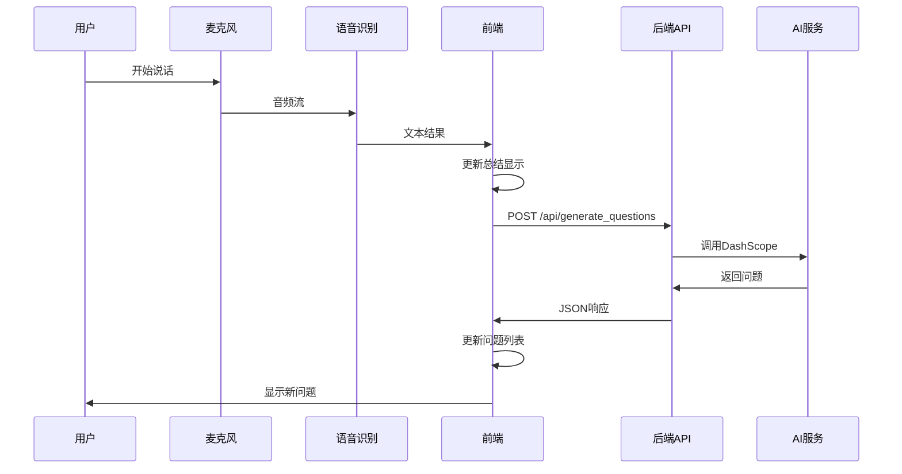

# 🌐 前端API调用详细说明

## 📋 API调用流程

### 1. **语音识别触发**
```javascript
// 当语音识别产生结果时触发
recognition.onresult = function(event) {
    // ... 获取语音转文本结果
    if (finalTranscript) {
        summaryText += finalTranscript;
        updateSummaryDisplay();
        
        // 🔥 关键：调用API生成问题
        if (dashScopeApiKey) {
            generateAcademicQuestionsWithAI(finalTranscript);
        } else {
            generateQuestions(finalTranscript); // 本地备用方案
        }
    }
};
```

### 2. **API调用函数**
```javascript
async function generateAcademicQuestionsWithAI(text) {
    try {
        statusBar.textContent = '状态: 正在使用AI生成学术问题...';
        
        // 🚀 核心API调用
        const response = await fetch('http://localhost:5002/api/generate_questions', {
            method: 'POST',                           // HTTP方法
            headers: {
                'Content-Type': 'application/json'    // 请求头
            },
            body: JSON.stringify({
                text: text                            // 请求数据
            })
        });
        
        // 处理响应
        if (!response.ok) {
            throw new Error(`API请求失败: ${response.status} ${response.statusText}`);
        }
        
        const data = await response.json();
        
        if (data.error) {
            throw new Error(data.error);
        }
        
        const aiQuestions = data.questions;
        
        // 🎯 问题处理逻辑
        if (aiQuestions.length > 0) {
            const newQuestion = aiQuestions[0];  // 只取第一个问题
            if (newQuestion && !questionsList.includes(newQuestion) && newQuestion.length > 3) {
                if (questionsList.length >= 5) {
                    questionsList.pop();          // 移除最后一个（保持5个问题）
                }
                questionsList.unshift(newQuestion);  // 添加到开头
            }
        }
        
        updateQuestionsDisplay();
        statusBar.textContent = '状态: AI问题生成完成';
        
    } catch (error) {
        console.error('AI问题生成失败:', error);
        statusBar.textContent = `状态: AI生成失败 - ${error.message}`;
        
        // 备用方案：使用本地规则
        generateQuestions(text);
    }
}
```

## 🔧 API调用详解

### **请求结构**
```http
POST /api/generate_questions
Content-Type: application/json
Host: localhost:5002

{
    "text": "语音转文字的学术内容..."
}
```

### **响应结构**
```json
{
    "questions": [
        "问题1：具体的学术问题...",
        "问题2：深入的技术质疑...",
        "问题3：实用性探讨..."
    ]
}
```

### **错误处理**
```json
{
    "error": "DASHSCOPE_API_KEY未配置"
}
```

## 🎯 调用时机

### **自动触发**
1. **语音识别产生结果**：每5-8秒语音片段转写完成后
2. **实时处理**：不等待演讲结束，边听边生成

### **手动触发**
1. **添加提问按钮**：用户可手动输入文本生成问题
2. **测试验证**：通过测试页面验证API功能

## 🔄 数据流



## 🛡️ 容错机制

### **多层容错**
1. **网络错误**：自动降级到本地问题生成
2. **API失败**：显示错误信息，使用备用方案
3. **空响应**：跳过处理，继续录音
4. **重复问题**：自动去重，避免重复显示

### **备用方案**
```javascript
function generateQuestions(text) {
    const newQuestions = [];
    const lowerText = text.toLowerCase();
    
    // 基于关键词的本地问题生成
    if (lowerText.includes('方法') || lowerText.includes('method')) {
        newQuestions.push('该方法的创新点是什么？理论基础是什么？');
    }
    // ... 更多规则
    
    // 添加到问题列表
    if (newQuestions.length > 0) {
        const newQuestion = newQuestions[0];
        if (!questionsList.includes(newQuestion)) {
            if (questionsList.length >= 5) {
                questionsList.pop();
            }
            questionsList.unshift(newQuestion);
        }
    }
    updateQuestionsDisplay();
}
```

## 📊 性能优化

### **防抖处理**
- 避免短时间内重复调用API
- 只在finalTranscript时触发

### **问题管理**
- 限制最多5个问题
- 自动去重
- 最新问题优先显示

### **状态反馈**
- 实时更新状态栏
- 错误信息友好提示

## 🧪 测试方式

### **1. 自动测试**
```bash
curl -X POST http://localhost:5002/api/generate_questions \
  -H "Content-Type: application/json" \
  -d '{"text":"测试学术内容"}'
```

### **2. 浏览器测试**
访问：`http://localhost:8082/test_questions.html`

### **3. 完整功能测试**
访问：`http://localhost:8082/simple_sci_listen.html`

## ⚠️ 注意事项

1. **CORS配置**：API服务器需要配置跨域支持
2. **端口一致性**：前端调用的端口要匹配API服务器端口
3. **API密钥**：需要正确配置DASHSCOPE_API_KEY
4. **网络连接**：确保能访问阿里云API服务
5. **错误处理**：实现完善的错误处理和用户反馈